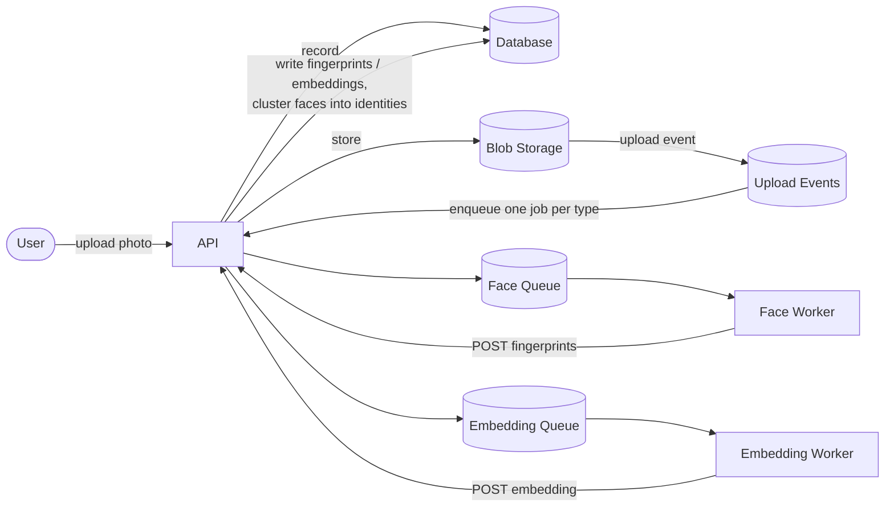
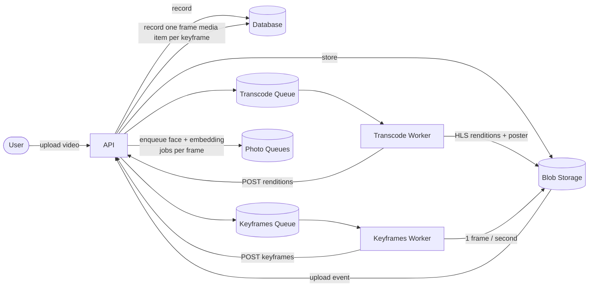

# Overview

C# API for media tagging app.

Has two workflows:
    1. Ingest Photo
    2. Ingest Video

Once a photo or video is ingested, a job is enqueued for it on a RabbitMQ queue for each job type registered for that media type. Each job type has its own queue and its own pool of Python workers.

When a worker finishes a job, it writes its output (for example: a fingerprint identifying a face within a photo or keyframe, or a CLIP embedding describing that photo or keyframe) back to the API over HTTP. The API upserts the result into the database; for fingerprints, it looks to find an existing vector using pgvector nearest-neighbour, and either attaches it to the matching person tag or creates a new one if no similar fingerprint was found.

Once results are in the database, we can perform semantic search: the query text is encoded to a CLIP vector, and candidates are ranked by pgvector similarity against the stored image embeddings. Faces can also be searched by fingerprint similarity.

## Architecture

This app is built with 4 decoupled tiers that communicate through durable message queues, S3 blob storage and a shared database. Jobs are pushed to the job's rabbitMQ queue and workers POST their results back through the API endpoint

The four tiers are:

- **API (ASP.NET Core)** — receives uploads, stores the file to S3 blob storage and records the media item result to database.
- **Queue (RabbitMQ)** — MinIO publishes an event on photo or video upload. the API consumes that event to push the event's data to each job in that job type group. Each job type has its own queue consumed by one worker group.
- **Workers (Kubernetes pods)** — Python containers that pull jobs off their queue, fetch the media from blob storage and run the job. Workers have no database access and they POST results to the API.
- **Database (PostgreSQL + pgvector)** — holds media items, jobs, tags, face fingerprints and image embeddings, and serves the vector similarity queries.

### Photo flow

A photo is uploaded and stored to blob storage under `photos/`. MinIO emits an upload event to RabbitMQ; the API consumes it and enqueues a face-recognition job and an image-embedding job. Each worker picks up its job, fetches the photo, and POSTs its result to the API, which writes it to the database.

### Video flow

A video is uploaded and stored under `videos/raw/`. The upload event enqueues two jobs: a transcode job (producing an HLS rendition ladder and a poster frame) and a keyframes job. The keyframes worker samples one frame per second with ffmpeg, uploads the frames to blob storage and POSTs them to the API. The API records each frame as its own media item with a timestamp and parent video id, then enqueues face-recognition and image-embedding jobs for every frame so frames are processed (and treated) like photos.

